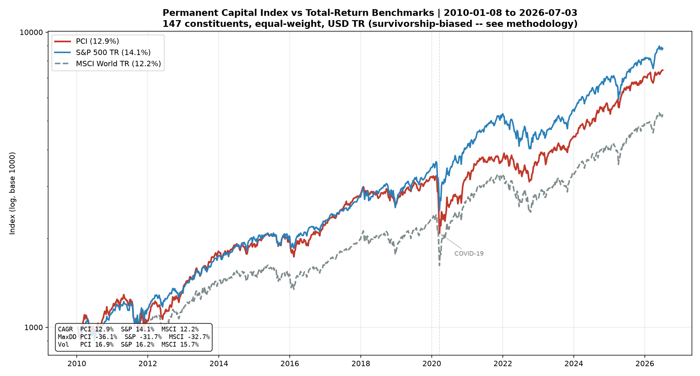

# Permanent Capital Index™ (PCI)

**A reproducible, openly specified benchmark of *permanent capital allocators*:
publicly traded companies that own and reallocate capital across a diversified portfolio
of assets, financed by capital with no redemption claim and an indefinite horizon.**

> Built from the DNA of Berkshire Hathaway, the Wallenberg sphere, and the Japanese
> *sogo shosha*: permanence of capital, owner alignment, and multi-decade compounding,
> selected by **structure, never by past performance**.

> **Release of record (September 2026).** Every figure below comes from one pinned,
> reproducible run, described in [`AGENTS.md`](AGENTS.md) §5; two constituents can no longer
> be priced (§7.4). Research only; not investment advice.

---

## What makes the PCI different

- **Selected by structure, not returns.** Membership is decided by a mechanical
  balance-sheet rule, never by who outperformed. This is deliberate: an index that selects
  winners cannot honestly be used to argue the category wins (see methodology 2.1).
- **Equal-weighted**: no mega-cap dominance.
- **Total return, USD.**
- **Bottom-up & reproducible**: any third party can regenerate the constituent list from
  the published rules and free public data.

**Current snapshot (June 2026):** 147 constituents across 26 countries. US weight ~28%
(vs over 60% in cap-weighted world indices): genuine geographic diversification falls out
of the rule mechanically.

---

## Honest backtest (2010–2026, total return, USD)

| | CAGR | Max Drawdown | Volatility | Sharpe |
|---|---|---|---|---|
| **PCI** | **12.9%** | −36.1% | 16.9% | 0.68 |
| S&P 500 (Total Return) | 14.1% | −31.7% | 16.2% | 0.77 |
| MSCI World (Total Return) | 12.2% | −32.7% | 15.7% | 0.68 |

<sub>Run of record: `--start 2010-01-01 --end 2026-06-30`, effective 2010-01-08 → 2026-07-03,
145 of 147 constituents priced (see [AGENTS.md](AGENTS.md) for why 145 and how to reproduce).
Figures move if you change `--end`, so always pin it.
MSCI World (URTH proxy) data begins 2012-01-13; its figures cover 2012–2026, not 2010–2026.</sub>



<sub>Run of record, log scale, base 1000. MSCI World (URTH proxy) data begins 2012-01-13; its
line starts there, rebased to 1000, and its figures cover 2012–2026, not 2010–2026.</sub>

The PCI sits **between** the two benchmarks: modestly ahead of MSCI World, behind the
US-mega-cap-led S&P 500, at comparable risk. **This is not a claim of alpha.** The figure
carries an upward **survivorship bias** (delisted/failed names are absent from free data),
so the true number is likely somewhat lower. The contribution of this project is a
*reproducible, honestly measured* category benchmark, not a backtest that beats the market.
See [methodology §7](methodology/pci-index-methodology.md) for the full limitations.

---

## Methodology in one screen

A candidate is included if it passes **one uniform mechanical rule** (no per-name judgment):

- **G1 (Permanence & durability):** an operating corporation (not a fund/ETF/BDC/SPAC),
  listed ≥ 3 years.
- **G3 (Allocation signature):** investment-type assets (stakes, equity-method associates,
  long-term investments, insurance portfolios) ≥ 30% of total assets, and PP&E ≤ 33%.
- **G5 (Investability):** market cap ≥ USD 250M.

No performance gate. Owner alignment and fine-grained diversification are *disclosed
attributes*, not automated filters (free ownership/segment data is unreliable). Full detail:
[`methodology/pci-index-methodology.md`](methodology/pci-index-methodology.md) ·
rationale: [`methodology/pci-theoretical-framework.md`](methodology/pci-theoretical-framework.md).

---

## Repository structure

```
permanent-capital-index/
├── whitepaper/
│   └── pci-whitepaper.md
├── methodology/
│   ├── pci-index-methodology.md       # canonical rules (single source of truth)
│   └── pci-theoretical-framework.md   # why the category should have an edge
├── scripts/
│   ├── universe_screener.py           # bottom-up structural screen (G1/G3/G5)
│   ├── simulator.py                   # equal-weight total-return backtest
│   ├── compare_countries.py           # per-country benchmark charts
│   └── requirements.txt
├── data/
│   ├── pci_candidate_universe.csv     # bottom-up candidate tickers
│   ├── pci_screened_v4.csv            # screen output (CONSTITUENT/REJECT + ratios)
│   ├── pci_constituents_v4.csv        # the 147 constituents
│   └── historical/pci_levels.csv      # backtest index levels vs benchmarks
└── charts/
```

---

## Quick start

```bash
pip install -r scripts/requirements.txt

# 1. Screen the candidate universe (structural, no performance gate). Resumable.
python scripts/universe_screener.py --universe csv:data/pci_candidate_universe.csv

# 2. The constituents are the CONSTITUENT-status rows of data/pci_screened_v4.csv
#    (saved as data/pci_constituents_v4.csv).

# 3. Run the honest, total-return backtest (equal weight, USD, semi-annual reconstitution).
#    Pin --end to a reconstitution date: without it the period runs to *today* and the
#    published figures above will not reproduce.
python scripts/simulator.py --start 2010-01-01 --end 2026-06-30
```

To widen the universe beyond the bundled candidates, the screener also accepts
`--universe sec` (all US tickers via SEC EDGAR) and any `csv:` ticker file; the
exhaustive global run is best done locally (it is throughput-bound on free data).

---

## License (MSCI-style model)

The methodology is **open by design**; the brand and official index data are protected.

- **Methodology & documentation:** [CC BY 4.0](https://creativecommons.org/licenses/by/4.0/)
- **Code (`scripts/`):** [MIT](https://opensource.org/licenses/MIT)
- **Name "Permanent Capital Index" / "PCI" / logo:** trademark. Using them to name or
  market a financial product requires a license.

See [`LICENSE.md`](LICENSE.md). Not investment advice; see methodology §7 for limitations.

---

*Inspired by Warren Buffett and Berkshire Hathaway, and by the dozens of overlooked
permanent-capital compounders the world has never heard of.*
